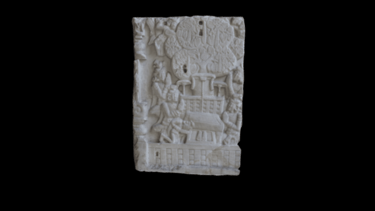

 

# 3D model of th Amaravati Panel

3D data for recreation of a British Museum object.

Back: Relief of the Bodhi tree and an empty dias with Buddhapada on the step, flying celestials above and kneeling worshippers on each side.
Front: Relief depicting a stūpa with a figure of the Buddha standing at the entrance; about the dome of the stūpa flying celestials, some playing instruments. On the dome are relief panels depicting the Gift of Sujātā, the Conversion of Nanda, the First Sermon, the Great Departure, the Birth of the Buddha and Māyā’s Dream.
Height: 124.37 centimetres Width: 86.25 centimetres Thickness: 12.5 centimetres 1st Century BC (obverse face) 3rd Century (reverse face)

[COL entry](http://bit.ly/2cSDUtK)

# LICENSE
The contents of this repository are licensed under CC-BY-NC-SA

# Credits

Photographs by Tom Flynn (SketchFab) and models by Daniel Pett <dpett@britishmuseum.org>, Digital Humanities Lead, British Museum. Annotations on Sketchfab by Imma Ramos, British Museum.
